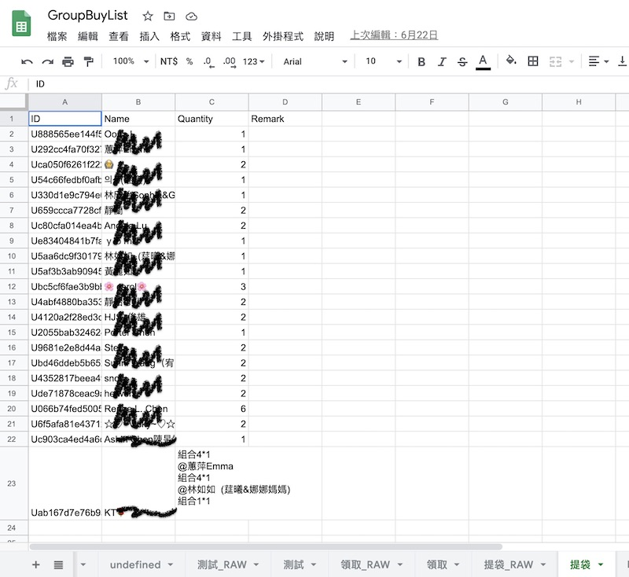
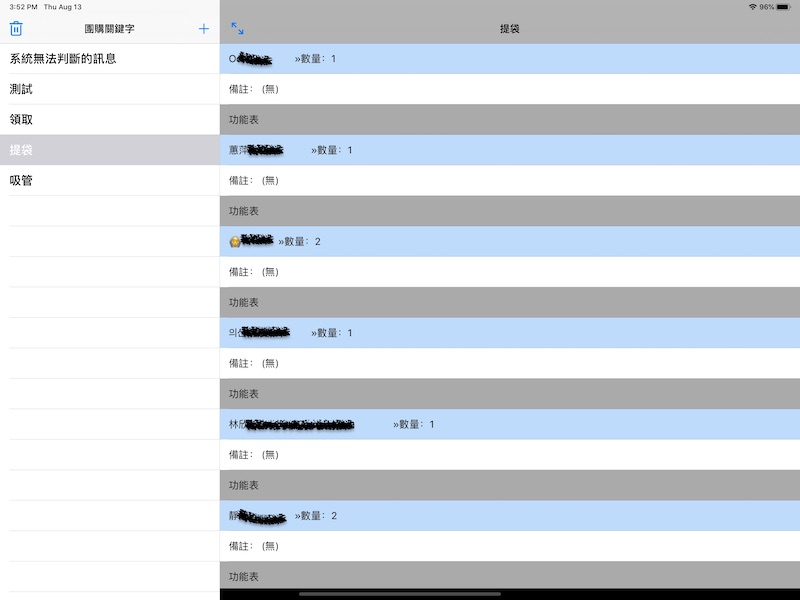

#  groupbuyAssist

## 功能介紹
這是可以幫助LINE團購群組的主揪整理團購清單的app。
這套系統是先透過LINE機器人監聽跟團的關鍵字(+1)，並記錄在資料庫裡面

然後使用這個app可以連到資料庫檢視有哪些人跟團，也可以直接修改數量

這裡的LINE機器人是用google apps script所寫，後端使用google sheet當作資料庫，前台的app是以JSON傳輸，中間則是經由google apps script去讀寫google sheet

## 遭遇問題
原本的功能是在群組中留言跟團時回覆揪團的訊息，LINE機器人讀取時判讀訊息的回覆對象做跟團歸類

但是由於LINE官方提供給機器人使用的API並沒有辦法判讀回覆訊息的部分所以才變成監聽關鍵字，在使用上沒有辦法精確的歸類團購的物品，因此這個系統就停止繼續開發維護了
